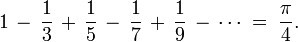

<head>
<title>多线程</title>
<meta http-equiv="Content-Type" content="text/html; charset=UTF-8">
</head>

# 多线程
## 编译，加入-lpthread选项，和pthread库链接
- cc -o program program.c -lpthread

## API参考
- [pthread_create](api/pthread_create.html)
- [pthread_join](api/pthread_join.html)

## 例子
- [create](thread/create.c)
- [share](thread/share.c)
- [join](thread/join.c)
- [param](thread/param.c)
- [bug](thread/bug.c)

## 题目
- pi1.c: 使用2个线程根据莱布尼兹级数计算PI
    + 莱布尼兹级数公式:  
    + 主线程创建1个辅助线程 
    + 主线程计算级数的前半部分  
    + 辅助线程计算级数的后半部分 
    + 主线程等待辅助线程运行結束后,将前半部分和后半部分相加

- pi2.c: 使用N个线程根据莱布尼兹级数计算PI
    + 与上一题类似，但本题更加通用化，能适应N个核心，需要使用线程参数来实现
    + 主线程创建N个辅助线程 
    + 每个辅助线程计算一部分任务，并将结果返回
    + 主线程等待N个辅助线程运行结束，将所有辅助线程的结果累加 

- sort.c: 多线程排序
    + 主线程创建一个辅助线程 
    + 主线程使用选择排序算法对数组的前半部分排序  
    + 辅助线程使用选择排序算法对数组的后半部分排序 
    + 主线程等待辅助线程运行結束后,使用归并排序算法归并数组的前半部分和后半部分
